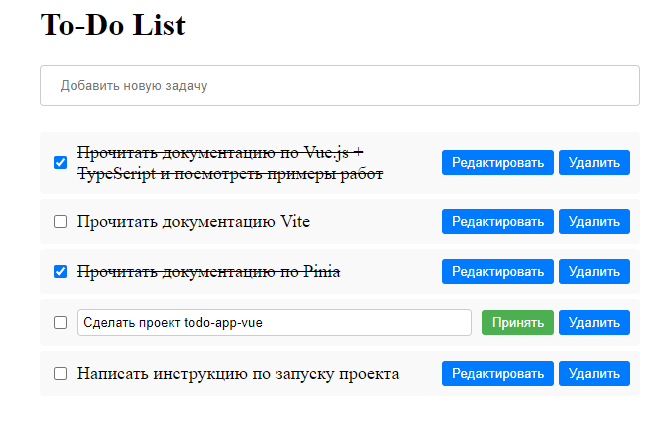

# Todo-app-vue

## Example of the application in operation


### Installation

Cloning the repository
```bash
git clone https://github.com/BosovPN/todo-app-vue.git
```

Move into directory where we have the project files 
```bash
cd todo-app-vue
```

Install the dependencies
```bash
npm install
```

### Running the Project in development mode
```bash
npm run dev
```

### Building a project
```bash
npm run build
```

### Run build for preview
```bash
npm run serve
```